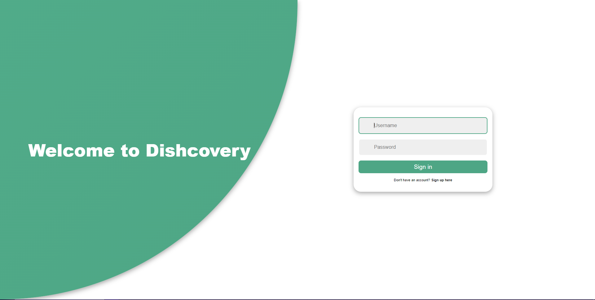
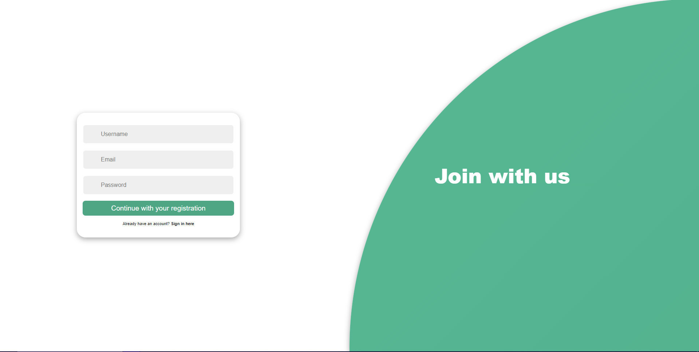
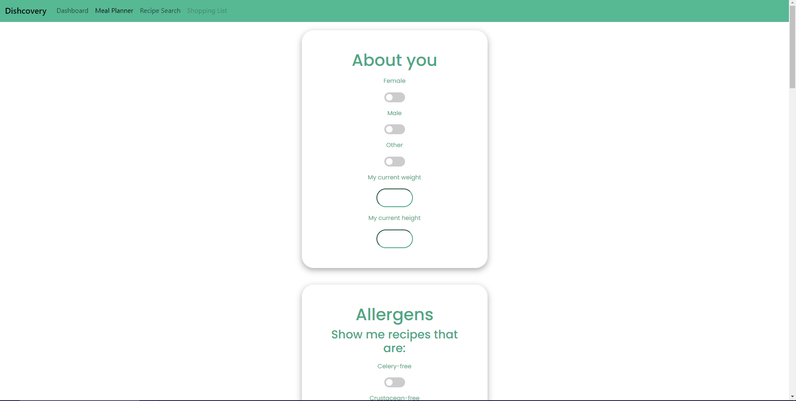
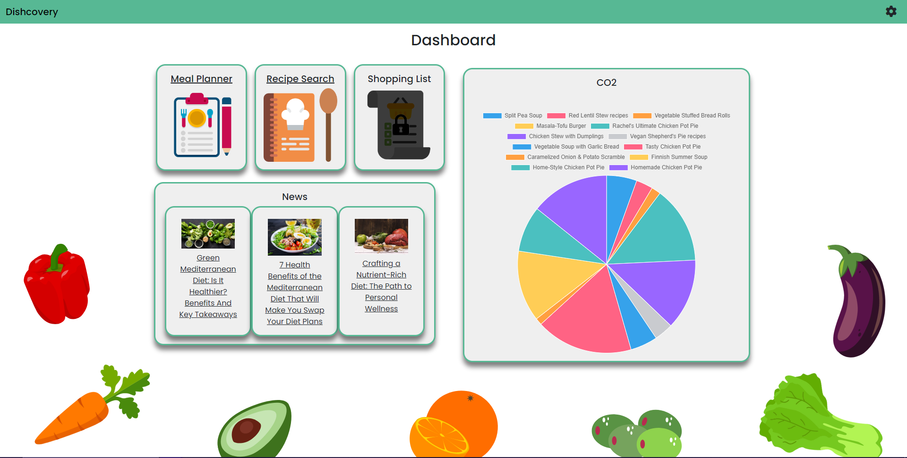
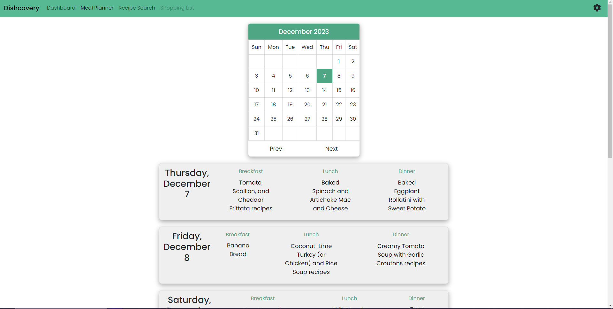
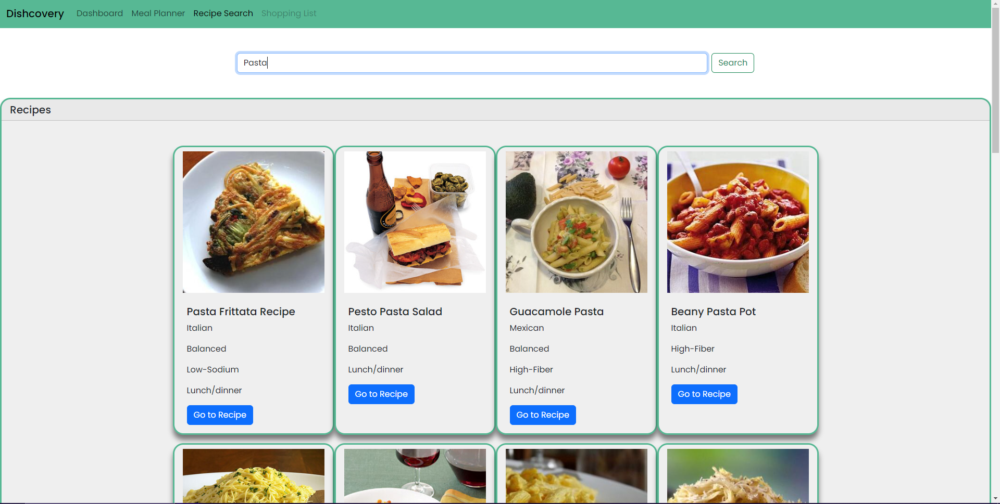

# Dishcovery: A weekly meal planner and recipe search application 

## Description 
Comprehensive meal planning app designed to help users create personalised, delicious, and environmentally conscious weekly meal plans. The app considers dietary preferences, nutritional goals, and carbon footprint awareness to deliver a holistic and sustainable meal-planning experience. 

### Motivation 
The following points outline our motivations for creating this application: 

1. Increases awareness of the environmental impact of food choices.
2. Staying conscious of health and nutrition.
3. Encourages sustainable living through mindful food choices.
4. Simplifies the meal planning process
5. Uses technology to make a positive impact

## Installation 
The application is live and deploys from the following link: https://kaiwright.github.io/dishcovery

## Usage
The user can create an account, or sign in to an account that has been saved in local storage. They are then taken to a screen where they can input information about themselves, their dietary requirements and the times that they would like meal planning for. 

The user is then taken to a dashboard, where they can see news articles relating to healthy eating topics, and a chart that shows the CO2 emissions of recipes (currently at random, would be from the recipes in the meal plan). From here, they can choose to go to either the meal planner or the recipe search. 

The meal planner loads recipes for the user according to the categories of breakfast, lunch and dinner. They can click on any of these to take them to the recipe in a new tab. 

The recipe search allows the user to put in any number of keywords, and it will then return related recipes, with the cuisine type and nutritional information shown. The user can click on the buttons to open the recipe in a new tab. 

### Screenshots
#### User Sign In

#### User Registration

#### User Preferences

#### Dashboard

#### Meal Planner

#### Recipe Search

## Credits
All work was done by Kai Wright, Kane Vieira-Hooper and Rosa Lucena Saladie.

## Licence
This project is licensed under the [MIT License] - see LICENSE file for details.
